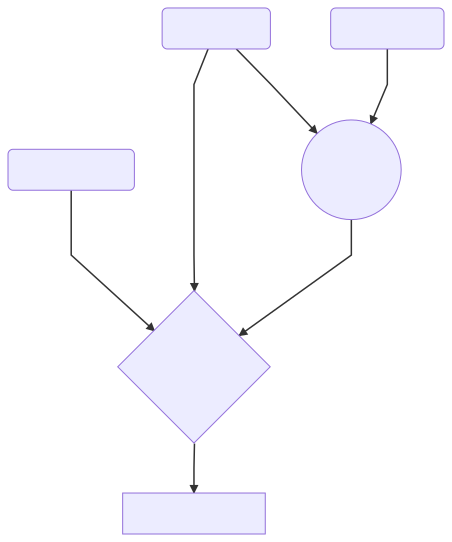

# Targets

Now you know how to compile a single file using three lines of CMake. But what happens if you have more than one file with dependencies? You need to be able to tell CMake about the structure of your project, and it will help you build it. To do so, you will need targets.

You've already seen a target:

```cmake
add_executable(myexample simple.cpp)
```

This creates an "executable" target with the name `mytarget`. Target names must be unique (and there is a way to set the executable name to something other than the target name if you really want to).

Targets are much like "objects" in other languages; they have properties (member variables) that hold information. The `SOURCE_FILES` property, for example, will have `simple.cpp` in it.

Another type of target is a library:

```cmake
add_library(mylibrary simplelib.cpp)
```

You can add the keywords `STATIC`, `SHARED`, or `MODULE` if you know what kind of library you want to make; the default is sortof an "auto" library that is user selectable with `BUILD_SHARED_LIBS`.

You can make non-built libraries too. More on that later, once we see what we can do with targets.

## Linking

Once you have several targets, you can discribe the relationship between them with `target_link_libraries` and a keyword; one of `PUBLIC`, `PRIVATE`, and `INTERFACE`.

{:height="500px" }

<!--
Spaces added to -- > to allow comment to continue
graph TD
P(Public Library) -- > |PUBLIC| M((Main Library))
R(Private Library) -- > |PRIVATE| M
I(Interface Library) -- > |INTERFACE| T
P -- > |PUBLIC| T
M -- > T{Target: mylibrary}
T -- > E[Target: myprogram]
-->

Figure 1: Example of PUBLIC, PRIVATE, and INTERFACE. `myprogram` will build the three libraries it sees through `mylibrary`; the private library will not affect it.

There are two collections of properties on every target that can be filled with values; the "private" properties control what happens when you build that target, and the "interface" properties tell targets linked to this one what to do when building. The `PUBLIC` keyword fills both property fields at the same time.

> ## Try it out
>
> Get this repository and go to the example. Try to write a CMakeLists that will correctly build.
>
> ```bash
> git clone https://github.com/henryiii/cmake_workshop.git
> cd cmake_workshop/code/01-simple
> ```
>
> The files here are:
> * simple_lib.cpp: Must be compiled with `MYLIB_PRIVATE` and `MYLIB_PUBLIC` defined.
> * simple_example.cpp: Must be compiled with `MYLIB_PUBLIC` defined, but not `MYLIB_PRIVATE`
>
> Use `target_compile_definitions(<target> <private or public> <definition(s)>)` to set the definitions on `simple_lib`.
> > ## Solution
> >
> > ```cmake
> > cmake_minimum_required(VERSION 3.11)
> >
> > project(MyExample01 LANGUAGES CXX)
> >
> > # This is the library
> > # Including the headers is not required, but is nice for users
> > add_library(simple_lib
> >   simple_lib.cpp
> >   simple_lib.hpp
> > )
> >
> > # The above line *did not* set the includes - we need to
> > # We can also set ., and it should be expanded to the current source dir
> > target_include_directories(simple_lib PUBLIC "${CMAKE_CURRENT_SOURCE_DIR}")
> >
> > # Adding definitions
> > target_compile_definitions(simple_lib PUBLIC MYLIB_PUBLIC)
> > target_compile_definitions(simple_lib PRIVATE MYLIB_PRIVATE)
> >
> > add_executable(simple_example
> >   simple_example.cpp
> > )
> >
> > # Adding the all-important link to simple-lib
> > target_link_libraries(simple_example PUBLIC simple_lib)
> > ```
> {:.solution}
{:.challenge}

### Things you can set on targets
* [`target_link_libraries`](https://cmake.org/cmake/help/latest/command/target_link_libraries.html): Other targets; can also pass library names directly
* `target_include_directories`: Include directories
* `target_compile_features`: The compiler features you need activated, like `cxx_std_11`
* `target_compile_definitions`: Definitions
* `target_compile_options`: More general compile flags
* `target_link_directories`: Don't use, give full paths instead (CMake 3.13+)
* `target_link_options`: General link flags (CMake 3.13+)
* `target_sources`: Add source files

See more [commands here](https://cmake.org/cmake/help/latest/manual/cmake-commands.7.html).

## Other types of targets

You might be really exited by targets and are already planning out how you can describe your programs in terms of targets. That's great! However, you'll quickly run into two more situations where the target language is useful, but you need some extra flexibility over what we've covered.

First, you might have a library that conceptually should be a target, but doesn't actually have any built components - a "header-only" library. These are called interface libraries in CMake and you would write:

```cmake
add_library(some_header_only_lib INTERFACE)
```

Notice you didn't need to add any source files. Now you can set `INTERFACE` properties on this only (since there is no built component).

The second situation is if you have a pre-built library that you want to use. This is called an imported library in CMake, and uses the keyword `IMPORTED`.  Imported libraries can also be interface libraries, they can built and modified using the same syntax as other libraries (starting in CMake 3.11), and they can have `::` in thier name. (`ALIAS` libraries, which simply rename some other library, are also allowed to have `::`). Most of the time you will get imported libraries from other places, and will not be making your own.

> ## More reading
>
> * Based on [Modern CMake basics][]
> * Also see [CMake's docs](https://cmake.org/cmake/help/latest/index.html)
{:.checklist}


[Modern CMake Basics]: https://cliutils.gitlab.io/modern-cmake/chapters/basics.html
